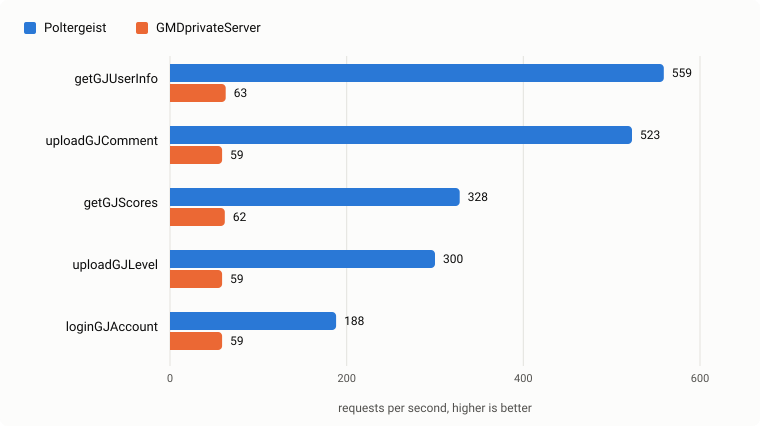

# Poltergeist

A Geometry Dash 2.2 server. Python 3.14, FastAPI, MySQL and Redis.

It implements the `/database/*.php` endpoints the game calls: accounts and
login, levels and lists, comments, likes, scores, friends and messages,
songs, map packs and gauntlets, daily, weekly and event levels, chests,
quests and vault rewards. Only the current client protocol is supported and
every request must be logged in.

Moderation runs in game through `!` commands in level comments (rating,
featuring, dailies, bans, roles) and through the admin area of
[rgdps-web](https://github.com/RealistikGDPS/rgdps-web). What an account may
do is decided by dotted permission strings such as `levels.rate` or
`users.ban.*`, granted through roles and per-user overrides.

## Layout

```
app/api/gd      Game endpoints
app/api/health  Internal health check for the container and the website
app/main.py     Entry point, selected by APP_COMPONENT
scripts/        Container start scripts
configuration/  Example environment files
```

The services, repositories and adapters live in
[poltergeist-core](https://github.com/RealistikGDPS/poltergeist-core).

## Running

The `Dockerfile` builds the image. `configuration/app.env.example` lists the
variables the server reads and `configuration/mysql.env.example` the database
credentials. `APP_COMPONENT=fastapi` serves the game;
`APP_COMPONENT=rebuild_leaderboards` recomputes the Redis rankings and exits.

Point the client at `http://<host>/database`. The first administrator is
granted by hand; every later role goes through the website's admin area:

```sql
INSERT INTO user_roles (user_id, role_id) VALUES (<id>, 5);
```

## Events

Major actions (registrations, level uploads and ratings, bans, roles,
settings changes) are announced on Redis Pub/Sub channels named
`poltergeist:*`, each message carrying `"component": "poltergeist"`. The
envelope and the event catalogue are documented in
[poltergeist-core](https://github.com/RealistikGDPS/poltergeist-core#events).

## Benchmarks

Compared with [GMDprivateServer](https://github.com/Cvolton/GMDprivateServer)
on one 4 vCPU, 16 GB machine that also ran the load generator, so read the
numbers as relative. Both servers sat behind nginx on MySQL 8.0 with 4 workers
(4 uvicorn, 4 php-fpm), holding 100 users, 1000 levels and 500 comments. Load
came from `wrk` at 4 and 64 connections for reads and 4 and 32 for writes,
averaged over two passes. Poltergeist ran with the `poltergeist-core` commit
pinned in `uv.lock`, and its per-user rate limits for comments, likes and
uploads were lifted for the write runs.

Only endpoints where GMDprivateServer also checks the player's credentials are
compared, since Poltergeist checks them on every request. Reads ran at 64
connections and writes at 32.



GMDprivateServer runs bcrypt on the `gjp2` of every request, which caps these
endpoints at about 60 requests per second. Poltergeist verifies a password once
and caches the session in Redis for an hour.

Concurrent logins for the same account can deadlock in MySQL and return a 500.
`note_login` takes shared locks on the user row through its foreign keys and
`touch_last_seen` then asks for an exclusive lock on the same row.

## Development

```bash
uv sync
make lint
```

To pick up a newer poltergeist-core:

```bash
uv lock --upgrade-package poltergeist-core
```
